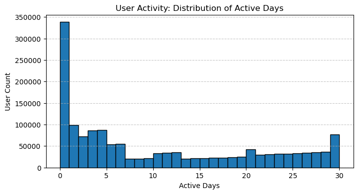
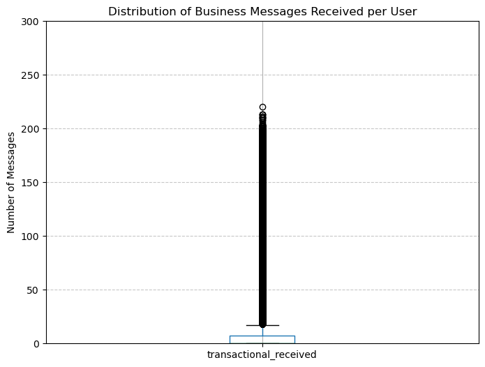

# Forecasting the Impact of a New Feature on Reminders Usage


A product analytics case study. I estimate how many new users a proposed feature could bring to an existing, under-used feature. The estimate is based on 30 days of activity from **1.5 million users** of a messaging app.

➡️ **[Open the notebook](notebooks/feature_adoption_forecast.ipynb)**

---

## Business context

The app has two related productivity features:

| Feature | What it does |
|---|---|
| **My Notes** | A private chat where users save messages, links and notes to themselves |
| **Reminders** | Schedules a reminder on a message inside My Notes |

**Proposed feature:** let users create a reminder straight from a **received message**, such as an appointment confirmation from a business, with one or two taps.

**Question:** How is Reminders used today, and how much could the new feature grow it?

## Key findings

| Metric | Value |
|---|---|
| Users in dataset | 1,500,000 |
| Active in the last 30 days | 1,161,798 (**77.5%**) |
| Active users who ever used My Notes | **27.3%** (avg. 4.5 days and ~67 notes a month) |
| My Notes users who ever used Reminders | **25.3%** |
| Reminders depth of use | ~**1 reminder a month** (median 1, max 9) |
| Active users who receive business messages | **35.8%** (avg. ~64 a month) |
| **Forecast: incremental Reminders users** | **≈ 65.6K, or ≈ 5.6% of active users** |

**Takeaways**

- **Reminders is under-used.** Many users try it, but the typical user sets only about one reminder a month. The friction is in creating a reminder, not in awareness of the feature.
- **My Notes is healthy.** It has 4 to 5 days of use a month, so a reminder flow built on it starts from an engaged base.
- **Business messages are the best entry point.** They often contain structured dates and times, such as appointments, deliveries and bookings. More than a third of active users receive them.
- **Adoption forecast.** I applied the conversion rate of *active* My Notes users to Reminders (17.4%) to business-message receivers who have never used Reminders (377K). That gives about **65.6K new Reminders users**.

## Methodology

1. **Data validation.** Checked for unique IDs, missing values and duplicates. Checked logical consistency: no Reminders activity without the "ever used" flag, and no Reminders use without My Notes use. Profiled extreme outliers, such as ~1M messages sent in a month.
2. **Engagement profiling.** Looked at the distribution of active days and found four segments: inactive, occasional, weekday and daily users. Also profiled the volume of sent, received and business messages.
3. **Feature adoption.** Measured reach and depth for My Notes and Reminders, and how much their user bases overlap.
4. **Target audience definition.** Compared four candidate audiences: business receivers and all receivers, each with and without current Reminders users. I separated two goals: *incremental* adoption and *total* engagement.
5. **Forecast.** Chose a conservative benchmark rate: active Reminders users among active My Notes users (17.4%) rather than the "ever used" rate (25.3%). I applied it to the primary audience.

<p align="center">
  
  
</p>

## Assumptions and limitations

- The forecast uses one month of data, so there is no trend or seasonality.
- The benchmark rate comes from current behaviour. It assumes the new, lower-friction flow converts *at least* as well as the existing one, so the estimate is conservative.
- The data does not show how many received messages contain a date or time. That share is the main driver of real-world usage.

## Next steps

- Measure how often business and personal messages include date or time entities, to estimate reminders per user.
- Benchmark against past features triggered by incoming messages, such as flagging or follow-ups.
- Segment heavy business-message receivers, who are likely early adopters.
- Validate the estimate with an A/B test, using incremental Reminders users and reminders per user as the primary metrics.

## Data

The dataset is **synthetic**. It was generated to mirror realistic messaging-app usage patterns and has no real user data. It is stored in this repository as a gzip-compressed CSV, about 11 MB.

| Column | Description |
|---|---|
| `user_id` | Unique user identifier |
| `active_days` | Days active out of the last 30 |
| `messages_sent` / `messages_received` | Messages sent and received in 30 days |
| `transactional_received` | Business (transactional) messages received, not included in `messages_received` |
| `has_used_my_notes_ever` | 1 if the user has ever used My Notes |
| `my_notes_days` / `my_notes_messages` | Days of My Notes use and messages saved in 30 days |
| `has_used_reminders_ever` | 1 if the user has ever used Reminders |
| `reminders_days` / `reminders_messages` | Days of Reminders use and reminders set in 30 days |

## Repository structure

```
feature-adoption-forecast/
├── data/
│   └── monthly_activity.csv.gz        # 1.5M-user synthetic activity dataset
├── images/                            # charts used in this README
├── notebooks/
│   └── feature_adoption_forecast.ipynb
├── requirements.txt
└── README.md
```

## How to run

```bash
git clone https://github.com/annapmp/projects.git
cd projects/feature-adoption-forecast
pip install -r requirements.txt
jupyter notebook notebooks/feature_adoption_forecast.ipynb
```

The notebook loads the dataset straight from this repository on GitHub, so you don't need any local files.
