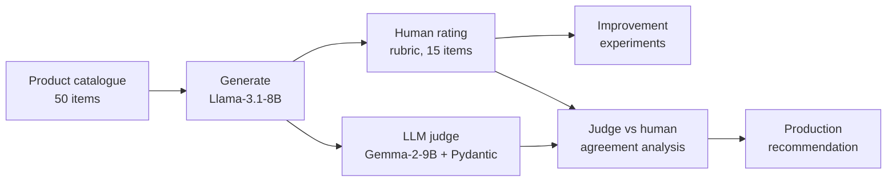

# LLM Product Description Generator & LLM-as-a-Judge Evaluation


This project is an end-to-end pipeline that uses open-weight LLMs to **generate e-commerce product descriptions** and then **evaluates them systematically**. It covers:

- a written quality rubric
- a human-rated baseline
- controlled improvement experiments
- an automated **LLM-as-a-judge** with structured output
- an analysis of how far the judge can be trusted compared with human raters

**Authors:** Anna Yusufova & Daniel Davidson

---

## Headline results

| | Result |
|---|---|
| Baseline pass rate (Llama-3.1-8B, 15 human-rated products) | **73%** (11/15). 2 fabricated "battery" claims |
| After prompt engineering alone | **93%** (14/15), **0 fabrications**, same cost |
| Best quality (Qwen3-30B-A3B) | **100%** (15/15) at ~3× the cost per call |
| **Best value** (Llama-8B + grounding prompt + sentence-boundary trimmer) | **93%**, same cost as baseline (~$0.00002 per call), guaranteed length compliance |
| LLM judge (Gemma-2-9B) on all 50 products | 94% pass. **~$0.00004 per evaluation**, ~1.6 s per call |
| Judge vs human agreement | **80% overall**: Grammar 93%, Grounding 80%, Fluency 80%, Tone 73%, Length 73% |

## Pipeline



| Step | What | Where |
|---|---|---|
| 1 | Define the evaluation rubric: 5 criteria, latency and cost thresholds, pass/fail rules | [`docs/evaluation_rubric.md`](docs/evaluation_rubric.md) |
| 2 | Generate descriptions for 50 products and log latency and token usage | [`01_generate_descriptions.ipynb`](notebooks/01_generate_descriptions.ipynb) |
| 3 | Rate 15 products by hand to create the human baseline | [`results/step3_human_ratings.xlsx`](results/step3_human_ratings.xlsx) |
| 4 | Run 4 controlled experiments: prompt, decoding, model, post-processing | [`02_improvement_experiments.ipynb`](notebooks/02_improvement_experiments.ipynb) |
| 5 | Build an LLM judge with schema-enforced JSON output | [`03_llm_judge.ipynb`](notebooks/03_llm_judge.ipynb) |
| 6 | Analyse the judge: sanity check, agreement with humans, per-criterion judging | [`04_judge_analysis.ipynb`](notebooks/04_judge_analysis.ipynb) |

## Improvement experiments

The baseline's critical failure was **hallucinated "battery life" claims** for a LEGO set and an NVMe SSD. The model copied an attribute label (`battery: long-lasting`) without checking whether it made sense for the product type.

| Experiment | Change | Pass | Grounding (bad) | Avg cost per call |
|---|---|---|---|---|
| Baseline | — | 11/15 | 2 | $0.000020 |
| 1. Prompt engineering | Attribute-type warning, "omit if unsure" rule, banned formulaic phrases | 14/15 | **0** | $0.000020 |
| 2. Decoding | temperature 0.7 → 0.3, top_p 1.0 → 0.9 | 13/15 | 0 | $0.000020 |
| 3. Model switch | Qwen3-30B-A3B (MoE) | **15/15** | 0 | $0.000064 |
| 4. Post-processing | Exp 2 settings + a trimmer that cuts to ≤ 90 words at a sentence boundary | 14/15 | 0 | $0.000020 |

**Takeaways**
- A targeted *negative constraint* in the prompt fixed every fabrication at no extra cost.
- Lowering the temperature did **not** help. It traded tone quality for little gain and was dropped.
- Deterministic post-processing is a cheap safety net for hard constraints like length. Trimming at sentence boundaries avoids the broken endings you get from cutting at `max_tokens`.
- A larger model gives the best quality, but the prompt fix plus the trimmer gets most of that quality at a third of the cost.

## LLM-as-a-judge

- **Structured output.** A Pydantic schema is enforced through the API's structured-output mode. In the schema, `explanation` comes *before* `verdict`, so the model reasons before it commits to a label, much like chain-of-thought.
- **Grounding needs context.** The judge sees both the original product data and the generated description, so it can trace each claim back to the input.
- **What we found:**
  - The judge **cannot count words reliably**. It reported 78 words for a 58-word text, so Length is computed in code and overrides the judge.
  - It is **more lenient than humans** on subjective criteria like Tone and Fluency.
  - It caught the LEGO fabrication but rated the identical SSD fabrication as only `ok`.
  - **Judging one criterion per call** fixed that grounding miss, at 5× the number of calls.

### Production recommendation: a three-tier hybrid

1. **Programmatic checks.** Length, latency and cost are deterministic, instant and free. Never delegate them to an LLM.
2. **LLM judge on 100% of outputs.** Use it for Grounding (one criterion per call) and Grammar, the criteria where it is most reliable and where errors carry the most risk. Anything rated `bad` gets flagged.
3. **Targeted human review.** Review everything flagged, a 2–5% random calibration sample, and all new product categories.

At about 1,000 descriptions a day, this means roughly 20–50 human reviews a day instead of 1,000.

## Tech stack

- **Models, served through Nebius AI Studio's OpenAI-compatible API:**
  - `Meta-Llama-3.1-8B-Instruct`
  - `Qwen3-30B-A3B-Instruct`
  - `Gemma-2-9B-it` (the judge)
- **Python libraries:** `openai`, `pydantic`, `pandas`, `openpyxl`, `python-dotenv`

## Repository structure

```
llm-product-description-eval/
├── data/
│   └── products.csv                     # 50 products: name, attributes, material, warranty
├── docs/
│   └── evaluation_rubric.md             # criteria, thresholds, pass/fail rules
├── notebooks/
│   ├── 01_generate_descriptions.ipynb
│   ├── 02_improvement_experiments.ipynb
│   ├── 03_llm_judge.ipynb
│   └── 04_judge_analysis.ipynb
├── results/                             # outputs of each step (.xlsx)
├── .env.example
├── requirements.txt
└── README.md
```

## How to run

```bash
git clone https://github.com/annapmp/projects.git
cd projects/llm-product-description-eval
pip install -r requirements.txt
cp .env.example .env        # then add your NEBIUS_API_KEY
jupyter notebook notebooks/
```

Run the notebooks in order. Each one reads the previous step's output from `results/`. Every saved output is committed, so you can review the analysis without running anything.
