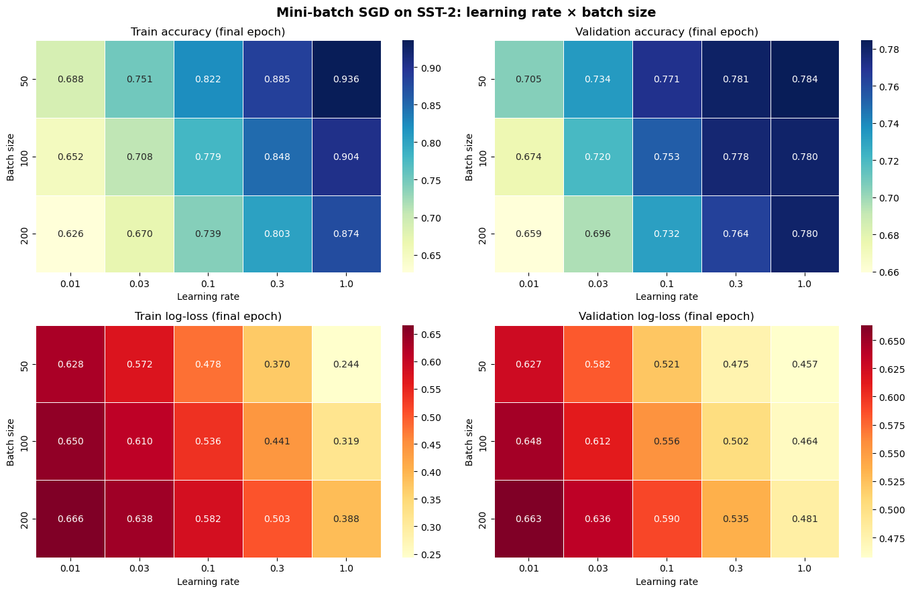
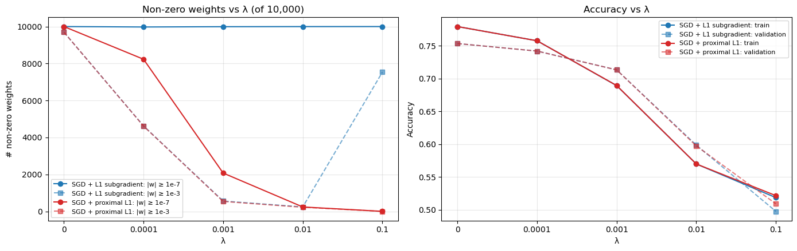
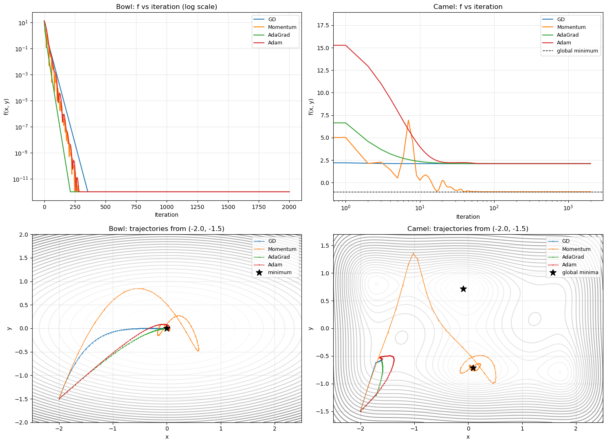
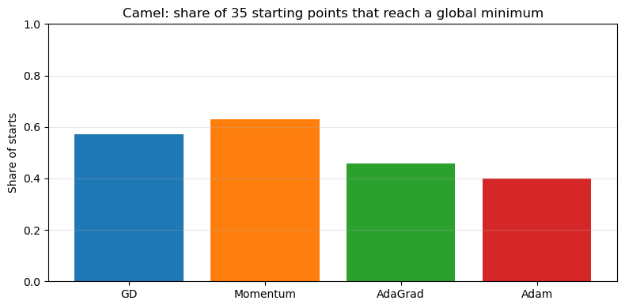

# Optimization from Scratch in PyTorch


This project implements the core machinery of model training **by hand, using only PyTorch primitives**, and runs controlled experiments to show how it behaves:

- a numerically stable loss
- logistic regression trained with mini-batch SGD
- L1 regularisation, both as a subgradient and as a proximal step
- four optimizers (GD, Momentum, AdaGrad and Adam) on convex and non-convex surfaces

➡️ **[Open the notebook](notebooks/optimization_from_scratch.ipynb)**

**Author:** Anna Yusufova

---

## Key findings

| Topic | Finding |
|---|---|
| **Numerical stability** | Clamping probabilities only works if ε is representable. In float32, `1 − 1e-15 == 1.0`, so the "stable" loss still returns `NaN`. Using ε = 1e-7 fixes it. |
| **Learning rate × batch size** | Within 20 epochs, larger learning rates and smaller batches converge faster. Validation accuracy plateaus at **~78%** while training accuracy reaches 94%, which is the ceiling of a linear bag-of-words model. |
| **L1 with plain SGD** | Shrinks weights but produces **almost no exact zeros** (≥ 9,976 of 10,000 weights stay non-zero). The weights oscillate around 0 with amplitude ≈ αλ. |
| **L1 with a proximal step** | Soft-thresholding gives **true sparsity** at the same accuracy: **79% of features removed** at λ = 1e-3, for −4 points of validation accuracy. |
| **Optimizers** | Adaptive methods (AdaGrad, Adam) fix ill-conditioning on the convex bowl. On the non-convex Camel function, the **starting basin** decides the outcome: even the best method reaches the global minimum from only 63% of starts. |

## What's implemented

| Component | Details |
|---|---|
| Features | Text cleaning and bag-of-words over the top 10k training tokens. The vocabulary is built on the training split only, to avoid leakage. |
| Loss | Binary cross-entropy with ε-clamping, plus a worked explanation of the max-shift trick for softmax |
| Model | `nn.Module` logistic regression with zero, small-random or user-supplied initialisation |
| Training loop | Mini-batch SGD with per-epoch shuffling, per-epoch train/validation loss and accuracy (or F1), and an optional per-step weight history |
| Regularisation | L1 (subgradient), **L1 (proximal / soft-thresholding)**, L2 |
| Optimizers | GD, Momentum, AdaGrad and Adam as small update rules plugged into one shared runner, instead of four copy-pasted loops |
| Experiments | A 15-run learning-rate × batch-size grid, a λ sweep for two L1 methods, and optimizer comparisons from a fixed start and from **35 different starts** |

## Results

### Learning rate × batch size (SST-2, 20 epochs)

<p align="center"></p>

Small learning rates are far from converged after 20 epochs. At lr = 1.0 the validation loss becomes noisy, but it still reaches the best accuracy. Smaller batches win at a fixed number of epochs because they make more updates.

### L1 regularisation: subgradient vs proximal

<p align="center"></p>

With the plain subgradient, weights never reach exactly zero. At large λ they bounce around zero with amplitude αλ, so a *stronger* penalty looks *less* sparse. The proximal step removes features exactly.

### Optimizers on a convex bowl vs the Six-hump Camel function

<p align="center"></p>

From (−2, −1.5), only Momentum builds enough velocity to cross the ridge into a global minimum. The other three settle in the nearest local minimum.

<p align="center"></p>

## Data

[SST-2 (Stanford Sentiment Treebank)](https://huggingface.co/datasets/SetFit/sst2): binary sentiment labels for movie-review sentences, with 6,920 for training and 872 for validation. The notebook downloads it from the Hugging Face Hub. The dataset is public, so no account or token is needed.

## Repository structure

```
optimization-from-scratch/
├── images/                               # figures used in this README
├── notebooks/
│   └── optimization_from_scratch.ipynb   # implementation, experiments and analysis
├── requirements.txt
└── README.md
```

## How to run

```bash
git clone https://github.com/annapmp/projects.git
cd projects/optimization-from-scratch
pip install -r requirements.txt
jupyter notebook notebooks/optimization_from_scratch.ipynb
```

All runs are seeded. The full notebook runs on a laptop CPU in about 2–3 minutes.
